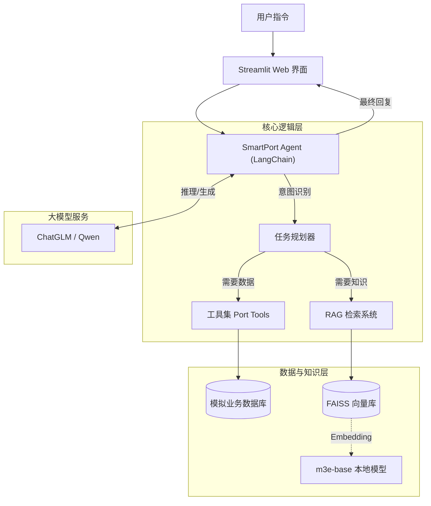

<div align="center">

# 🚢 SmartPortAgent | 智能口岸通关异常诊断助手

<!-- 这里建议放一张项目的 Logo 或 Banner 图片 -->
<!--  -->

[](https://www.python.org/)
[](https://github.com/astral-sh/uv)
[](https://www.langchain.com/)
[](LICENSE)

[](https://open.bigmodel.cn/)
[](https://help.aliyun.com/zh/model-studio/)
[]()

**基于 LLM Agent 和 RAG 技术的智慧口岸业务模拟系统**

[快速开始](#-快速开始) • [功能特性](#-核心特性) • [技术架构](#-技术架构) • [演示截图](#-演示截图)

</div>

---

## 📖 项目简介

**SmartPortAgent** 旨在解决外贸人员在货物出口过程中遇到的“数据碎片化”和“异常状态难解读”痛点。

通过自然语言对话，Agent 能够自动编排任务，查询集装箱、报关和船期状态，并结合内置的**海关法规知识库**诊断异常（如海关查验），提供专业的行动建议。用户只需提供箱号，即可完成 **“查询-诊断-建议”** 的全流程。

### 🎯 解决什么问题？
- ❌ **信息分散**：不再需要分别登录码头、海关、船公司网站。
- ❌ **状态晦涩**：自动解读 “H98 查验” 等专业代码含义。
- ❌ **决策困难**：基于截关时间（CVT）计算赶船风险，提供决策辅助。

---

## 📸 演示截图

<!-- 方式 A: 标准 Markdown 语法 (无法调整大小) -->


<!-- 方式 B: HTML 语法 (推荐，可居中、调大小) -->
<!-- <div align="center">
  
</div> -->

---

## ✨ 核心特性

- **🤖 智能任务规划 (Agent)**: 基于 LangChain ReAct 模式，自动分解用户意图并调用模拟 API 工具。
- **📚 专家知识库 (RAG)**: 内置宁波口岸查验流程与监管政策，利用 FAISS + m3e-base 实现本地化高精检索。
- **🔌 全链路模拟**: 包含集装箱进港、报关放行、船舶截关时间等完整的模拟业务数据。
- **💡 智能风控**: 综合船期与查验进度，自动计算风险等级并给出“预漏装”等专业建议。

---

## 🛠 技术架构



**技术栈详情：**
- **开发语言**: Python 3.10+
- **依赖管理**: `uv` (极速包管理)
- **LLM 框架**: LangChain v0.1
- **向量检索**: FAISS (CPU) + HuggingFace (m3e-base)
- **前端界面**: Streamlit

---

## 📂 项目结构

```text
SmartPortAgent/
├── .venv/                   # [自动生成] 虚拟环境
├── data/
│   ├── vector_store_index/  # FAISS 向量索引文件
│   ├── knowledge_base.txt   # RAG 知识库源文件 (口岸政策/SOP)
│   └── mock_api_data.json   # 模拟 API 业务数据
├── model/                   # 本地 Embedding 模型目录
├── script/                  # 运维脚本 (构建索引/下载模型)
├── src/
│   ├── agent/               # Agent 核心逻辑 (ReAct)
│   ├── rag/                 # RAG 检索模块
│   ├── tools/               # 模拟 API 工具函数
│   └── web/                 # Streamlit 前端界面
├── .env.example             # 环境变量模版
├── main_cli.py              # 命令行启动入口
├── pyproject.toml           # 依赖配置
└── uv.lock                  # 版本锁定文件
```

---

## 🚀 快速开始

本项目强烈推荐使用 **[uv](https://github.com/astral-sh/uv)** 进行环境管理，体验极致速度。

### 环境准备与依赖安装

确保已安装 `uv` (如未安装：`curl -LsSf https://astral.sh/uv/install.sh | sh`)。

```bash
# 克隆项目
git clone https://github.com/YourUsername/SmartPortAgent.git
cd SmartPortAgent

# 初始化环境并同步依赖 (自动下载 Python 3.11)
uv sync
```

<details>
<summary><b>点击展开：使用传统的 pip/venv 安装</b></summary>

```bash
python -m venv venv
# Windows
venv\Scripts\activate
# Mac/Linux
source venv/bin/activate

pip install -r requirements.txt
```
</details>

### 配置密钥

复制配置文件并填入你的 API Key（智谱 GLM 或 阿里 Qwen）：

```bash
cp .env.example .env
```
编辑 `.env` 文件：
```ini
ZHIPU_API_KEY="your_zhipu_api_key"
DASHSCOPE_API_KEY="your_qwen_api_key"
```

### 下载模型与构建索引 (重要)

为保证数据隐私与速度，本项目使用本地 Embedding 模型。

```bash
# 下载 m3e-base 模型 (支持断点续传，已配置国内镜像)
uv run script/download_sentence_embedding_model.py

# (可选) 如果修改了 data/knowledge_base.txt，需重新构建索引
# uv run script/build_vector_store.py
```

### 启动应用

**方式 A: Web 可视化界面 (推荐)**
```bash
uv run streamlit run src/web/app.py
```
> 浏览器将自动打开 http://localhost:8501

**方式 B: 命令行模式 (调试用)**
```bash
uv run main_cli.py
```

---

## 💬 使用示例

启动后，尝试发送以下指令：

> "帮我查一下集装箱 **NBCT1234567**，提单号是 **BILL002**，这票货明天能赶上‘中远海运金牛座’这艘船吗？现在一直没显示放行，我很急。"

**Agent 输出预览：**

| 模块 | 内容详情 |
| :--- | :--- |
| **🔍 状态核查** | • 集装箱：已进港 (宁波北仑三期)<br>• 报关状态：查验 (**代码 H98**)<br>• 船期：明日 14:00 截关 (**风险极高**) |
| **🧠 智能诊断** | H98 指令通常代表机检。如果机检图像正常，4-6 小时可放行；若转人工查验需 1-2 工作日。 |
| **💡 行动建议** | 1. 立即联系报关行确认是否收到移箱通知。<br>2. 鉴于离截关不足 24 小时，建议立即申请**“预漏装”**以保留下一水船期舱位。 |

---

## ⚠️ 免责声明

- 本项目仅为 **技术演示 (Demo)**，用于展示 LLM Agent 在物流领域的应用潜力。
- 项目中的所有数据（箱号、船期、状态）均为 **模拟数据** (`data/mock_api_data.json`)。
- 本项目未连接任何真实的港口或海关生产系统。

## 📄 License

MIT License © 2024 SmartPortAgent Team

---

<div align="center">
  <p>如果觉得这个项目对你有帮助，请给一个 ⭐️ Star 吧！</p>
</div>


## 附录
### 使用 uv 的步骤与命令

假设你已经位于 `SmartPortAgent` 文件夹下。

#### 第一步：安装 uv (如果尚未安装)
```bash
# macOS / Linux
curl -LsSf https://astral.sh/uv/install.sh | sh

# Windows (PowerShell)
powershell -c "irm https://astral.sh/uv/install.ps1 | iex"
```

#### 第二步：初始化项目
这将创建 `pyproject.toml` 文件（现代 Python 项目标准配置）。

```bash
uv init
```

#### 第三步：指定 Python 版本
我们显式指定使用 Python 3.11 以确保兼容性。`uv` 会自动为你下载并管理这个版本的 Python，不会污染你的系统环境。

```bash
uv python pin 3.11
```

#### 第四步：添加依赖
我们将 `requirements.txt` 中的依赖迁移到 `uv` 管理。

```bash
# 添加核心依赖
uv add langchain langchain-core langchain-community langchain-huggingface zhipuai python-dotenv

# 添加 AI 计算库 (这些库对版本敏感)
uv add faiss-cpu sentence-transformers
```
*执行完上述命令后，`uv` 会自动创建 `.venv` 虚拟环境并安装好所有包。*

#### 第五步：运行项目
使用 `uv run` 可以自动加载虚拟环境和 `.env` 变量（uv 0.4+ 支持自动加载 .env，如果不生效可手动加载）。

```bash
uv run main_cli.py
```

### 下载Sentence Embedding模型

这是为您准备的 `README.md` 补充内容。这段说明涵盖了**前置准备**、**运行命令**以及**下载后的验证**，适配了 `uv` 工具流。

---

### 📥 下载 Embedding 模型

本项目采用本地加载的 `moka-ai/m3e-base` 向量模型来处理 RAG 知识检索，以确保数据的私密性与响应速度。首次运行项目前，**必须**执行下载脚本。

#### 1. 快速下载（推荐）

直接使用 `uv` 运行下载脚本，无需手动激活环境：

```bash
# 1. 确保环境依赖已同步
uv sync

# 2. 运行下载脚本
uv run script/download_sentence_embedding_model.py
```

#### 2. 手动运行

如果你习惯手动激活虚拟环境：

```bash
# Windows
.venv\Scripts\activate
python script/download_sentence_embedding_model.py

# Mac/Linux
source .venv/bin/activate
python script/download_sentence_embedding_model.py
```

> **💡 说明**：
> *   脚本**已内置国内镜像加速**（hf-mirror.com），无需额外配置环境变量。
> *   支持**断点续传**，如果下载中断，重新运行命令即可。

#### 3. 验证下载

下载完成后，请检查项目根目录下是否生成了 `model` 文件夹，结构如下即为成功：

```text
SmartPortAgent/
└── model/
    └── m3e-base/
        ├── config.json
        ├── model.safetensors (或 pytorch_model.bin)
        ├── tokenizer.json
        └── ... (其他配置文件)
```